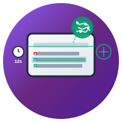
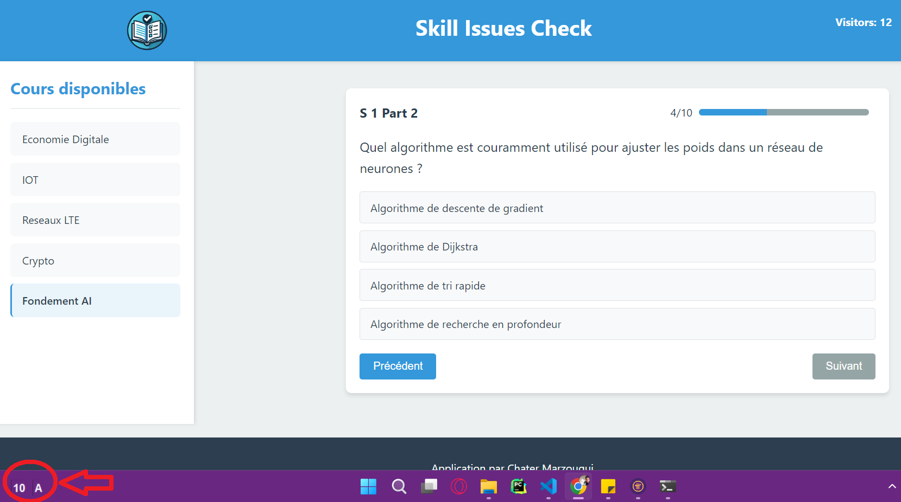

<a name="readme-top"></a>

<div align="center">

[![Contributors][contributors-shield]][contributors-url]
[![Forks][forks-shield]][forks-url]
[![Stargazers][stars-shield]][stars-url]
[![Issues][issues-shield]][issues-url]
[![MIT License][license-shield]][license-url]
[![LinkedIn][linkedin-shield]](https://www.linkedin.com/in/chater-marzougui-342125299/)
</div>


## ⚠️ Ethical Use Statement

**ScreenSolver is designed as a study aid and learning tool only.**

This software is intended for:
- Self-assessment during study sessions
- Practicing with sample questions
- Educational purposes to understand question patterns and formats

**This software should NOT be used for:**
- Cheating during exams, tests, or assessments
- Circumventing academic integrity policies
- Any form of dishonest academic conduct

Using this software in violation of educational institution policies may result in serious academic consequences. The developers of ScreenSolver do not condone or support any unethical use of this software.

By using ScreenSolver, you agree to use it responsibly and in accordance with all applicable academic integrity policies.

---

# 🎯 ScreenSolver

**Your automated assistant for timed multiple-choice questions.**  
Built with ❤️ in Python and Gemini AI.


<br />
<div align="center">
  <a href="https://github.com/chater-marzougui/ScreenSolver">
     
  </a>
  <a href="https://chater-marzougui.github.io/ScreenSolver">
    <h1 width="35px">ScreenSolver
    </h1>
  </a>
  <p align="center">
    <br />
    <br />
    <a href="https://github.com/chater-marzougui/ScreenSolver/issues/new?labels=bug&template=bug-report---.md">Report Bug</a>
    ·
    <a href="https://github.com/chater-marzougui/ScreenSolver/issues/new?labels=enhancement&template=feature-request---.md">Request Feature</a>
  </p>
</div>

<br/>


---

<details>
  <summary>Table of Contents</summary>
  <ol>
    <li><a href="#-about-screensolver">About ScreenSolver</a></li>
    <li><a href="#-features">Features</a></li>
    <li><a href="#-tech-stack">Tech Stack</a></li>
    <li><a href="#-project-structure">Project Structure</a></li>
    <li><a href="#-installation">Installation</a></li>
    <li><a href="#-getting-a-gemini-api-key">Getting a Gemini API Key</a></li>
    <li><a href="#-how-to-use">How to Use</a></li>
    <li><a href="#-configuration">Configuration</a></li>
    <li><a href="#-adding-custom-context">Adding Custom Context</a></li>
    <li><a href="#-requirements">Requirements</a></li>
    <li><a href="#-troubleshooting">Troubleshooting</a></li>
    <li><a href="#-license">License</a></li>
    <li><a href="#-contributing">Contributing</a></li>
    <li><a href="#-contact">Contact</a></li>
    <li><a href="#-disclaimer">Disclaimer</a></li>
  </ol>
</details>

<div align="right">
  <a href="#readme-top">
    
  </a>
</div>

---

## 📱 About ScreenSolver

**ScreenSolver** is a lightweight desktop utility designed to help users with timed multiple-choice questions. It automatically captures your screen, analyzes question content using Google's Gemini AI, and displays the most likely correct answer - all with a minimal, unobtrusive interface that stays out of your way.

This project demonstrates practical AI integration in a desktop application - combining screen capture, OCR capabilities, AI reasoning, and a clean user interface to create a helpful study companion.

### 📸 Screenshot

<div align="center">
   
   <p><em>ScreenSolver in action - analyzing multiple-choice questions with AI-powered assistance</em></p>
</div>

<div align="right">
  <a href="#readme-top">
    
  </a>
</div>

---

## ✨ Features

- 🔄 **Automatic Screen Monitoring** with configurable intervals (12 seconds default)
- 🤖 **AI-Powered Answer Detection** using Google's Gemini 2.0 Flash model
- 💡 **Instant Answer Display** in a compact, floating interface
- ⌨️ **Global Hotkey Support**:
  - `Shift+A` - Toggle visibility
  - `Ctrl+Shift` - Take immediate screenshot
  - `Ctrl+Space` - Toggle pause/resume
  - `Shift+R` - Reload application and refresh context
  - `Shift+Ctrl+X` - Close application
- 🖱️ **Right-Click Menu** for quick access to controls
- 🔝 **Always-on-Top Display** that never interferes with your workflow
- 🔢 **Countdown Timer** showing seconds until next analysis
- 🔍 **JSON Response Parsing** for structured answer extraction
- 📚 **Custom Context Support** via `context.txt` for enhanced accuracy
- ⏸️ **Pause/Resume Functionality** for better control
- 🎯 **Draggable Interface** - move the window anywhere on screen

<div align="right">
  <a href="#readme-top">
    
  </a>
</div>

---

## 🧠 Tech Stack

| Component | Technologies |
|-----------|--------------|
| **UI** | Tkinter |
| **Image Processing** | PIL (Pillow) |
| **AI Integration** | Google Generative AI (Gemini) |
| **Input Handling** | Keyboard library |
| **Threading** | Python threading module |
| **Environment Management** | python-dotenv |

<div align="right">
  <a href="#readme-top">
    
  </a>
</div>

---

## 📁 Project Structure

```
screensolver/
├── app.py                       # Main application file
├── requirements.txt             # Dependencies
├── .env                         # API key configuration (create this)
├── .env_example                 # Environment template
├── context.txt                  # Custom context for AI (optional)
├── screenshots/                 # Temporary screenshot storage
└── README.md                    # Documentation
```

<div align="right">
  <a href="#readme-top">
    
  </a>
</div>

---

## 👷🏼 Installation

### Step 1: Clone the Repository
```bash
git clone https://github.com/chater-marzougui/ScreenSolver.git
cd ScreenSolver
```

### Step 2: Set Up Virtual Environment
Create and activate a virtual environment to isolate dependencies:

**On Windows:**
```bash
# Create virtual environment
python -m venv venv

# Activate virtual environment
venv\Scripts\activate
```

**On macOS/Linux:**
```bash
# Create virtual environment
python3 -m venv venv

# Activate virtual environment
source venv/bin/activate
```

### Step 3: Install Dependencies
```bash
pip install -r requirements.txt
```

### Step 4: Configure Environment
1. Create your `.env` file by copying the example:
```bash
cp .env_example .env
```

2. Edit the `.env` file and add your Google Generative AI API key:
```
API_KEY=your_gemini_api_key_here
```

### Step 5: Run the Application
```bash
python app.py
```

<div align="right">
  <a href="#readme-top">
    
  </a>
</div>

---

## 🔑 Getting a Gemini API Key

1. Visit the [Google AI Studio](https://aistudio.google.com/)
2. Sign in with your Google account
3. Create a new API key
4. Copy the key and paste it into your `.env` file

<div align="right">
  <a href="#readme-top">
    
  </a>
</div>

---

## 🧑‍💻 How to Use

1. **Launch the application** - A small window will appear in the bottom-left corner of your screen

2. **Let it run** - The application will automatically:
   - Take screenshots every 12 seconds
   - Analyze any multiple-choice questions visible on screen
   - Display the detected answer in the right box
   - Show a countdown timer in the left box

3. **Controls**:
   - **Shift+A** - Toggle visibility of the window
   - **Ctrl+Shift** - Take immediate screenshot and reset timer
   - **Ctrl+Space** - Pause/resume automatic screenshots
   - **Shift+R** - Reload application and refresh context
   - **Shift+Ctrl+X** - Close the application
   - **Drag** the window to move it anywhere on screen
   - **Right-click** on the window for additional options:
     - Close the application
     - Toggle visibility
     - Take screenshot now

4. **Interpreting Results**:
   - The right box displays the detected answer choice (A, B, C, D, etc.)
   - "WAIT..." appears during processing
   - "X" is displayed if no question is detected
   - "Paused" appears when screenshot loop is paused

<div align="right">
  <a href="#readme-top">
    
  </a>
</div>

---

## 🪛 Configuration

### Environment Variables
Create a `.env` file with:
```
API_KEY=your_gemini_api_key_here
```

### Customizable Settings
You can modify these variables in the `UIConfig` class in `app.py`:
- `COUNTDOWN` - Time between screenshots (default: 12 seconds)
- `BG_COLOR` - Background color of the interface (default: "#000000")
- `TEXT_COLOR` - Text color of the interface (default: "#FFFFFF")
- `WINDOW_WIDTH` / `WINDOW_HEIGHT` - Interface dimensions

<div align="right">
  <a href="#readme-top">
    
  </a>
</div>

---

## 📚 Adding Custom Context

ScreenSolver supports custom context to improve AI accuracy for specific subjects or question types through the `context.txt` file.

### How to Use Context File

1. **Create the file**: Create a `context.txt` file in the project root directory

2. **Add your content**: Include any relevant information such as:
   - Course materials and lessons
   - Sample QCMs with correct answers
   - Subject-specific terminology
   - Question patterns you frequently encounter
   - Key concepts and formulas

3. **Example content**:
```
Computer Science Fundamentals

Sample Questions:
Q: What is the time complexity of binary search?
A: O(log n)

Q: Which data structure uses LIFO principle?
A: Stack

Key Concepts:
- Arrays are stored in contiguous memory locations
- Linked lists allow dynamic memory allocation
- Big O notation describes algorithmic complexity

Important Formulas:
- Binary search: O(log n)
- Linear search: O(n)
- Quicksort average case: O(n log n)
```

4. **Reload the application**: Use `Shift+R` to reload the application and refresh the context, or restart the application

### Context File Benefits

- **Improved Accuracy**: AI gets better context for domain-specific questions
- **Subject Specialization**: Tailor the AI's knowledge to your specific field of study
- **Pattern Recognition**: Help AI understand recurring question formats
- **Terminology Consistency**: Ensure AI uses correct subject-specific terms

### Context File Tips

- Keep the content relevant to your study material
- Include both questions and explanations
- Update the file as you progress through different topics
- Use clear, structured formatting for better AI comprehension
- The file is automatically reloaded when you use `Shift+R`

<div align="right">
  <a href="#readme-top">
    
  </a>
</div>

---

## 📋 Requirements

- Python 3.6+
- Internet connection (for Gemini API access)
- Google Generative AI API key
- Required libraries (automatically installed via requirements.txt):
  - `tkinter` (usually included with Python)
  - `Pillow`
  - `google-generativeai`
  - `keyboard`
  - `python-dotenv`

<div align="right">
  <a href="#readme-top">
    
  </a>
</div>

---

## 🔧 Troubleshooting

### Common Issues

**"API key not found" Error:**
- Ensure your `.env` file exists and contains a valid API key
- Check that the API key is correctly formatted
- Verify the `.env` file is in the same directory as `app.py`

**"Gemini not working" Error:**
- Verify your internet connection
- Confirm your Gemini API key is valid and has proper permissions
- Check if you've exceeded API rate limits

**Application Not Responding:**
- Try the global hotkeys (`Shift+A`, `Ctrl+Shift`, `Ctrl+Space`)
- Use `Shift+R` to reload the application
- Right-click on the window for the context menu
- Use `Shift+Ctrl+X` to force close if necessary

**Screenshots Not Working:**
- Ensure the `screenshots/` directory exists (created automatically)
- Check file permissions in the project directory
- Verify screen capture permissions on your system

**Context Not Loading:**
- Check that `context.txt` exists in the project root
- Verify the file has readable content
- Use `Shift+R` to reload the application after modifying context
- Ensure the file is saved in UTF-8 encoding

<div align="right">
  <a href="#readme-top">
    
  </a>
</div>

---

## 📃 License

MIT License — free to use, modify, and build upon.

<div align="right">
  <a href="#readme-top">
    
  </a>
</div>

---

## 🤝 Contributing

Contributions are welcome! Please feel free to submit a Pull Request. For major changes, please open an issue first to discuss what you would like to change.

<div align="right">
  <a href="#readme-top">
    
  </a>
</div>

---

## 📧 Contact

- Chater Marzougui - [@Chater-marzougui](linkedin-url) - chater.mrezgui2002@gmail.com <br/>

<div align="right">
  <a href="#readme-top">
    
  </a>
</div>

---

## ⚠️Disclaimer

This tool is provided for educational purposes only. Users are responsible for ensuring their use complies with all applicable laws, regulations, and institutional policies. The developers assume no responsibility for any misuse of this software.

<div align="right">
  <a href="#readme-top">
    
  </a>
</div>

---

🎓 _ScreenSolver: Because every second counts when you're taking a test._


[contributors-shield]: https://img.shields.io/github/contributors/chater-marzougui/ScreenSolver.svg?style=for-the-badge
[contributors-url]: https://github.com/chater-marzougui/ScreenSolver/graphs/contributors
[forks-shield]: https://img.shields.io/github/forks/chater-marzougui/ScreenSolver.svg?style=for-the-badge
[forks-url]: https://github.com/chater-marzougui/ScreenSolver/network/members
[stars-shield]: https://img.shields.io/github/stars/chater-marzougui/ScreenSolver.svg?style=for-the-badge
[stars-url]: https://github.com/chater-marzougui/ScreenSolver/stargazers
[issues-shield]: https://img.shields.io/github/issues/chater-marzougui/ScreenSolver.svg?style=for-the-badge
[issues-url]: https://github.com/chater-marzougui/ScreenSolver/issues
[license-shield]: https://img.shields.io/github/license/chater-marzougui/ScreenSolver.svg?style=for-the-badge
[license-url]: https://github.com/chater-marzougui/ScreenSolver/blob/master/LICENSE.txt
[linkedin-shield]: https://img.shields.io/badge/-LinkedIn-black.svg?style=for-the-badge&logo=linkedin&colorB=555
[linkedin-url]: https://linkedin.com/in/chater-marzougui-342125299