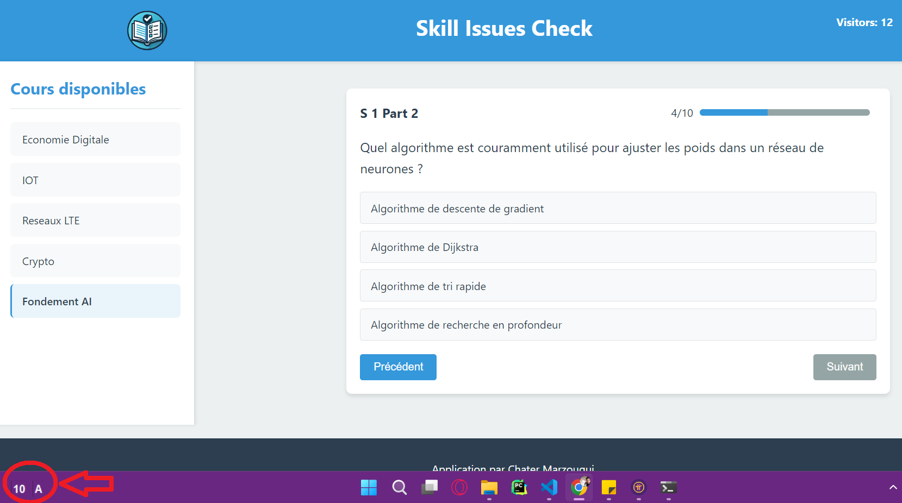

## ⚠️ Ethical Use Statement

**ScreenSolver is designed as a study aid and learning tool only.** 

This software is intended for:
- Self-assessment during study sessions
- Practicing with sample questions
- Educational purposes to understand question patterns and formats

**This software should NOT be used for:**
- Cheating during exams, tests, or assessments
- Circumventing academic integrity policies
- Any form of dishonest academic conduct

Using this software in violation of educational institution policies may result in serious academic consequences. The developers of ScreenSolver do not condone or support any unethical use of this software.

By using ScreenSolver, you agree to use it responsibly and in accordance with all applicable academic integrity policies.

---# 🎯 ScreenSolver

**Your automated assistant for timed multiple-choice questions.**  
Built with ❤️ in Python and Gemini AI.

---

## 📱 About ScreenSolver

**ScreenSolver** is a lightweight desktop utility designed to help users with timed multiple-choice questions. It automatically captures your screen, analyzes question content using Google's Gemini AI, and displays the most likely correct answer - all with a minimal, unobtrusive interface that stays out of your way.

This project demonstrates practical AI integration in a desktop application - combining screen capture, OCR capabilities, AI reasoning, and a clean user interface to create a helpful study companion.

---

## ✨ Features

- 🔄 **Automatic Screen Monitoring** with configurable intervals
- 🤖 **AI-Powered Answer Detection** using Google's Gemini 2.0 Flash model
- 💡 **Instant Answer Display** in a compact, floating interface
- ⌨️ **Global Hotkey Support** (Ctrl+Alt) to toggle visibility
- 🖱️ **Right-Click Menu** for quick access to controls
- 🔝 **Always-on-Top Display** that never interferes with your workflow
- 🔢 **Countdown Timer** showing seconds until next analysis
- 🔍 **JSON Response Parsing** for structured answer extraction

---

## 🧠 Tech Stack

| Component | Technologies |
|-----------|--------------|
| **UI** | Tkinter |
| **Image Processing** | PIL (Pillow) |
| **AI Integration** | Google Generative AI (Gemini) |
| **Input Handling** | Keyboard library |
| **Threading** | Python threading module |

---

## 📁 Project Structure

```
screensolver/
├── app.py              # Main application file
├── requirements.txt             # Dependencies
└── README.md                    # Documentation
```

---

## 🛠️ Installation

1. Clone the repository or download the script
2. Install the required dependencies:

```bash
pip install -r requirements.txt
```

3. Create your `.env` file by copying the example:

```bash
cp .env_example .env
```

4. Edit the `.env` file and add your Google Generative AI API key

5. Run the application:

```bash
python app.py
```

---

## 🧑‍💻 How to Use

1. **Launch the application** - A small purple window will appear in the bottom-left corner of your screen
2. **Let it run** - The application will automatically:
   - Take screenshots every 12 seconds (configurable)
   - Analyze any multiple-choice questions visible on screen
   - Display the detected answer in the right box
   - Show a countdown timer in the left box

3. **Controls**:
   - Press **Ctrl+Alt** to toggle visibility of the window
   - **Right-click** on the window for additional options:
     - Close the application
     - Toggle visibility

4. **Interpreting Results**:
   - The right box displays the detected answer choice (A, B, C, D, etc.)
   - If no question is detected, "X" will be displayed

---

## ⚙️ Configuration

1. Create a `.env` file in the same directory with your API key:
```
API_KEY=your_gemini_api_key_here
```

2. You can modify these variables in the script:
   - `countdown` - Time between screenshots (in seconds)
   - `prompt` - The instructions sent to Gemini AI

---

## 📋 Requirements

- Python 3.6+
- Internet connection (for Gemini API access)
- Required libraries (see requirements.txt)

---

## 🚀 Future Improvements

- GUI configuration panel
- Support for different question formats
- Local model option for offline use
- Customizable UI appearance
- Answer confidence scoring

---

## 📸 Screenshots



*ScreenSolver displaying countdown timer and detected answer*

---

## 📃 License

MIT License — free to use, modify, and build upon.

---

🎓 _ScreenSolver: Because every second counts when you're taking a test._